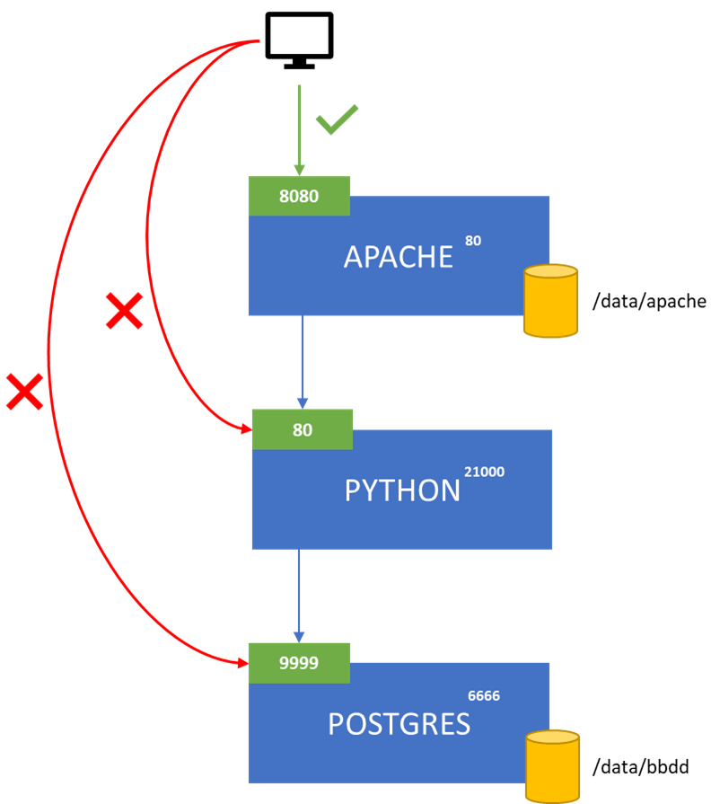
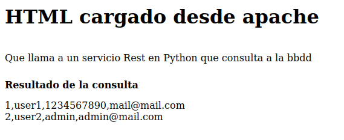

# Práctica kubernetes

## Enunciado

Para la realización de esta práctica se solicita desplegar en un cluster de minikube con un registry configurado los contenedores creados en la anterior parte del laboratorio en pods separados de kubernetes en un namespace llamado labk8s:

1. El pod de base de datos tendrá que:
    * tener un volúmen donde poder persistir los datos
        * El volúmen tiene que montarse en el directorio /data/bbdd de minikube
    * Configurarse con solo una réplica
    * Límite de CPU: 0.4
    * Límite memoria: 400 Mi
    * Tendra que poder ser accesible solo desde dentro de minikube mediante el puerto 9999 (no modificar la imagen ya creada)

2. El pod de python tendrá las siguientes características:
    * Configurarse con solo una réplica
    * Límite de CPU: 0.3
    * Límite memoria: 256 Mi
    * Tendra que poder ser accesible mediante solo desde dentro de minikube el puerto 80 (no modificar la imagen ya creada)

2. El pod de apache tendrá las siguientes características:
    * El número de pods en un inicio tendrá que ser 1
    * Límite de CPU: 200m
    * Límite memoria: 128 Mi
    * El servicio tendrá que exponerse por el puerto 8080 para que se pueda acceder a probar la aplicación.
    * El index.html tiene que estar en la máquina virtual, montado en el directorio data de minikube y montarlo en el directorio correcto en el pod para que apache lo pueda servir.

## ¿Cómo tiene que quedar?



## Extras

1. Despliegue de un cluster con 2 workers
2. Configuración del escalado automático 
3. Configuración de liveness y readiness
4. Añadir algún componente más de kubernetes

> **NOTA:** Si quieres hacer la parte **extra** de la práctica aquí tienes algunas configuraciones a tener en cuenta. 

### Pod de Postgres
* Configurar prueba de **readiness** para comprobar el puerto en el que levanta postgres. La configuración de esta prueba tiene que:
    * empezar con un delay de 10 segundos
    * comprobarse cada 60 segundos

### Pod Python
* Configurar un test de **startup** de tipo http a "/testbd" que:
    * Compruebe la conexión con la bbdd cada 20 segundos
    * Tenga un delay de 15 segundos
    * Realice el testeo un máximo de 5 veces
* Configurar un test de **liveness** de tipo http a "/accounts" que:
    * empieze con un delay de 40 segundos
    * se compruebe cada 70 segundos
    * no se reinicie hasta el segundo chequeo incorrecto
* Configurar un test de **readiness** de tipo command que: 
    * empieze con un delay de 10 segundos
    * se compruebe cada 20 segundos
    * ejecute un fichero test.sh que ejecute `echo "hola"` (¡OJO! Para esto sí tendréis que cambiar la imagen para que este script exista. Puedes tenerlo en /tmp/test.sh)
    * Cambie el estado a *not ready* al tercer fallo
    * se recupere con el primer chequeo correcto
* Configurar el **autoescalado** para que cuando se supere el 50% de uso de cpu se escale automáticamente hasta un límite de 2

### Pod Apache
* Configurar un test de **liveness** de tipo http que:
    * empieze con un delay de 10 segundos
    * se compruebe cada 90 segundos
    * se recupere en el tercer chequeo correcto

Hay algunas mejoras que se pueden incluir. Te proponemos alguna por si quisieras investigar:
* Variables mediante configmaps/secrets.

## Entregables

1. Entregar en un paquete tar comprimido con tu nombre y apellido (p.e. NombreApellido.tar.gz) que contenga:
   * los yaml de definición de todos los objetos pedidos en el enunciado.
   * Un pantallazo de la página que se carga accediendo a apache y que muestra el resultado de la consulta a bbdd. En el pantallazo tiene que aparecer la barra de direcciones y el resultado tendría que ser este
  <br><br>
    

   * un fichero grabado con `asciinema` en el que se vea cómo se consulta lo siguiente:
     * listado de servicios
     * listado de deployments
     * listado de persistent volume y persistent volume claim
     * listado de pods
     * descripción del pod de base de datos
     * descripción del deployment de la aplicación 
     * ejecutar el siguiente comando (antes tendrás que instalar `jq`) 
     ```sh
     wget -qO - http://ip_acceso:8080/app/getenv | jq .
     ```

2. En caso de creerlo conveniente, añadir un fichero README.txt con lo que se quiera comentar: comandos de despliegue, configuraciones a tener en cuenta, problemas encontrados y soluciones, etc.

## Evaluación

|||||
|------|-------:|-----|--------|
| Arquitectura solicitada | +50% |||
|  |  | +19% deployment Apache | +1% replicas <br> +4% variables <br>+2% límites cpu y memoria<br> +5% servicio <br> +7% volumen |
|  |  | +12% deployment Python | +1% replicas <br> +4% variables <br> +2% límites cpu y memoria<br> +5% servicio |
|  |  | +19% deployment Postgres| +1% replicas <br> +4% variables<br> +2% límites cpu y memoria<br> +5% servicio <br> +7% volumen |
| Despliegue 2 workers | +5% |||
| Escalado automático | +15% |||
| Pruebas de salud | +20% ||+3% readiness postgres <br> +8% readiness python <br> +3% liveness python <br> +3% startup python<br> +3% liveness apache||
| Componentes extra | +10% |||